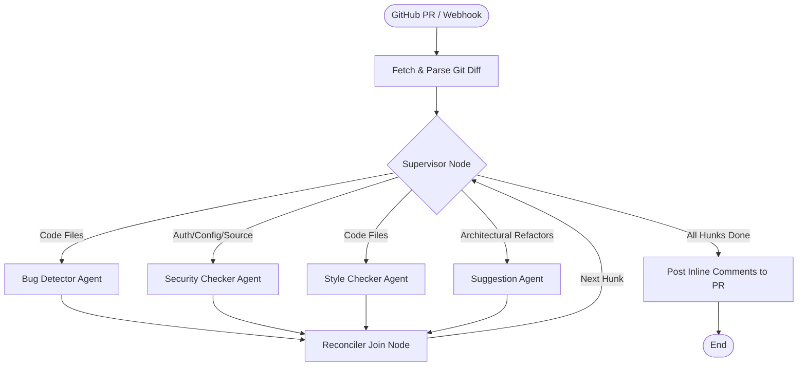

# 🤖 AI Code Reviewer Agent

A premium, agentic code review system built with **LangGraph**, **FastAPI**, and **Streamlit** to automate code reviews on GitHub Pull Requests. It parses PR diffs, schedules specialist AI agents in parallel, formats findings with suggested fixes, and posts them directly as inline comments on GitHub.

---

## 🏗️ Architecture & How It Works

The review pipeline is powered by an agentic graph structure built on **LangGraph**. The supervisor orchestrates a team of specialized review agents:



### 🧠 Specialized Agents:
1. **Security Checker**: Audits code for exposed credentials/API keys, SQL injection, XSS, weak cryptography, insecure storage, and authentication bypasses.
2. **Bug Detector**: Scans code for logical faults, off-by-one errors, infinite loops, index out of range, null/None pointer issues, and missing error handling.
3. **Style Checker**: Checks code against language conventions (PEP 8 for Python, ESLint for JavaScript, gofmt for Go) and reports on formatting, readability, and redundant code.
4. **Suggestion Generator**: Focuses on architectural improvements, algorithm complexity, performance optimization, and generates exact inline refactoring code suggestions.

---

## ✨ Key Features

- **Multi-Agent Collaboration**: Supervisor intelligently schedules only the relevant specialist agents depending on file type and metadata.
- **Interactive Streamlit Dashboard**: Enter PR URL, inspect the real-time execution trace logs of LangGraph, view issues by severity in categorized tabs, and post review comments to GitHub at the click of a button.
- **FastAPI Webhook Server**: Receive GitHub webhooks for automatic PR reviews when a Pull Request is `opened`, `reopened`, or `synchronize` (updated).
- **HMAC-SHA256 Signature Verification**: Secure webhook server endpoint that authenticates GitHub payloads.
- **Inline GitHub Comments**: Directly posts findings as markdown/review comments at the exact line number on the GitHub PR diff, with support for interactive ````suggestion```` blocks.

---

## 🛠️ Installation & Setup

### 1. Clone & Setup Virtual Environment
```bash
git clone https://github.com/shikhar2/AutoCodeReviewerAgent-.git
cd AutoCodeReviewerAgent-
python3 -m venv venv
source venv/bin/activate
pip install -r requirements.txt
```

### 2. Configure Environment Variables
Create a `.env` file in the project root:
```env
OPENAI_API_KEY=your-openai-api-key
GITHUB_TOKEN=your-personal-access-token
GITHUB_WEBHOOK_SECRET=your-webhook-secret  # Optional: For validating GitHub webhook payloads
```

---

## 🚀 Running the Services

### Start the Streamlit Dashboard
The Streamlit app provides a web UI to perform manual reviews on any PR.
```bash
venv/bin/streamlit run app.py
```
*Access it at `http://localhost:8501`*

### Start the Webhook Server
The FastAPI server listens for incoming GitHub webhooks to run reviews automatically.
```bash
venv/bin/python webhook_server.py
```
*Access it at `http://localhost:8000` (Webhook endpoint is `/webhook`)*

---

## 🧑‍💻 Manual Review via Streamlit

1. Enter your **OpenAI API Key** and **GitHub Token** in the sidebar (or load them via `.env`).
2. Provide a GitHub Pull Request URL (e.g., `https://github.com/owner/repo/pull/12`).
3. Click **🚀 Run Code Review**.
4. View the agent logs in real-time.
5. Review the issues organized under **Bug**, **Security**, **Style**, and **Suggestions** tabs.
6. Click **💬 Post Review Comments to PR** to publish them directly back to GitHub.
